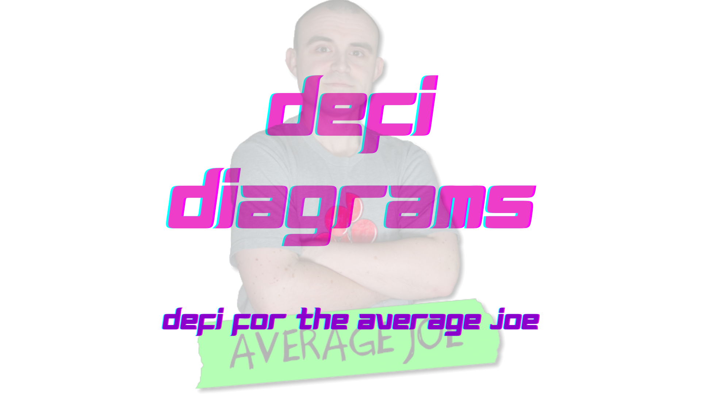
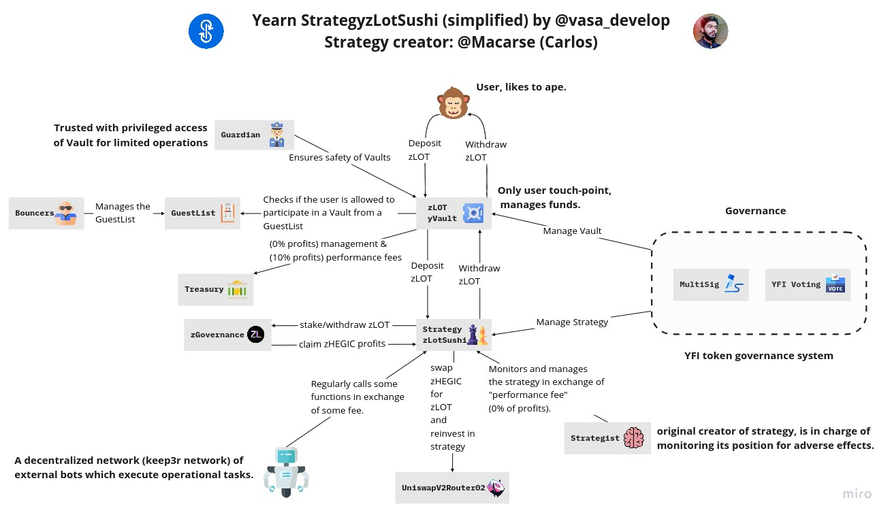
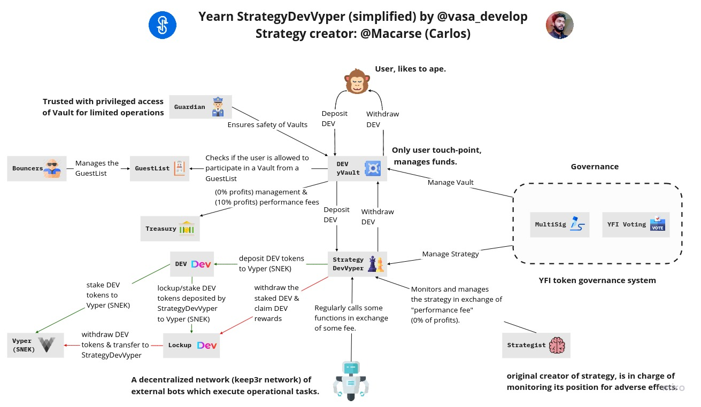

# DeFi Diagrams

> DeFi for the Average Joe

## Yearn Finance

### Yearn Vaults v1

#### Description

- **Simple:** [Official Vaults Overview](https://docs.yearn.finance/developers/yvaults-documentation/vaults-overview)

- **Technical:** [Official Vaults Interfaces](https://docs.yearn.finance/developers/yvaults-documentation/vault-interfaces)

### Yearn Vaults v2

#### Simple

#### Techincal

#### Description

[Official Specification](https://github.com/iearn-finance/yearn-vaults/blob/master/SPECIFICATION.md)

### Hegic Vault (V2)

#### StrategyHegicETH

#### Description

[Tweet Thread](https://twitter.com/vasa_develop/status/1337784594100195329)

#### StrategyHegicWBTC

#### Description

[Tweet Thread](https://twitter.com/vasa_develop/status/1338097570342526976)

### zLOT Vault (V2)

#### StrategyzLotSushi

#### Description

[Tweet Thread](https://twitter.com/vasa_develop/status/1338482754061627393)

### DEV Vault (V2)

#### StrategyDevVyper

#### Description

[Tweet Thread](https://twitter.com/vasa_develop/status/1338853439313387523)

### Exploits & Attacks

#### Pickle Finance Exploit

